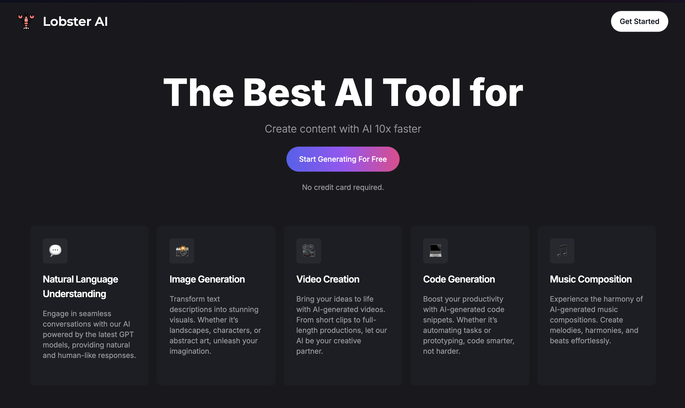
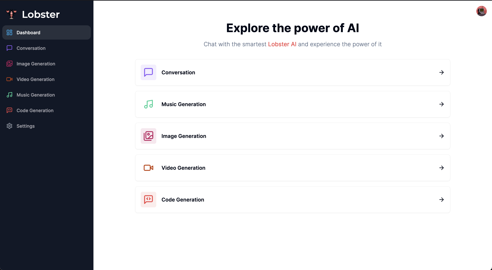
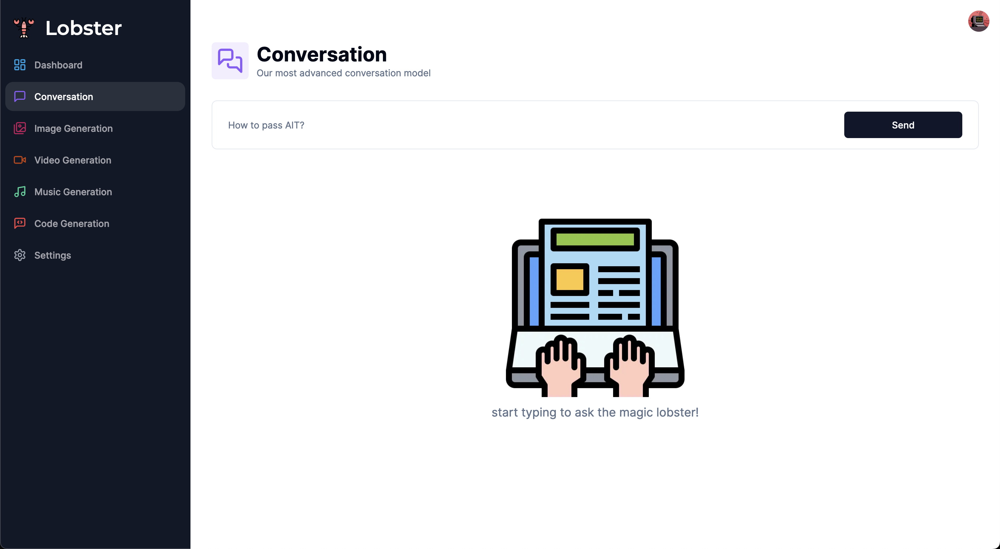
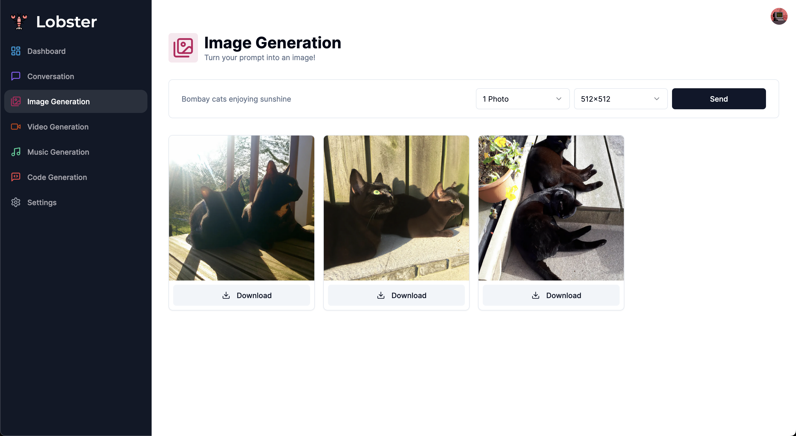
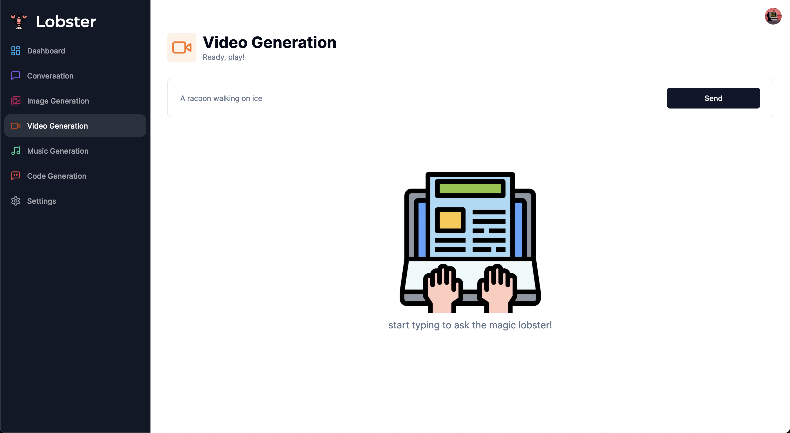
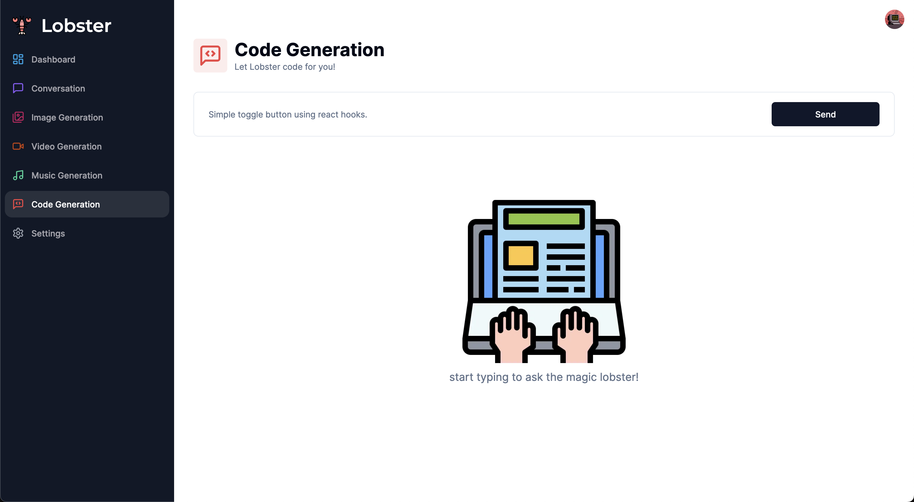
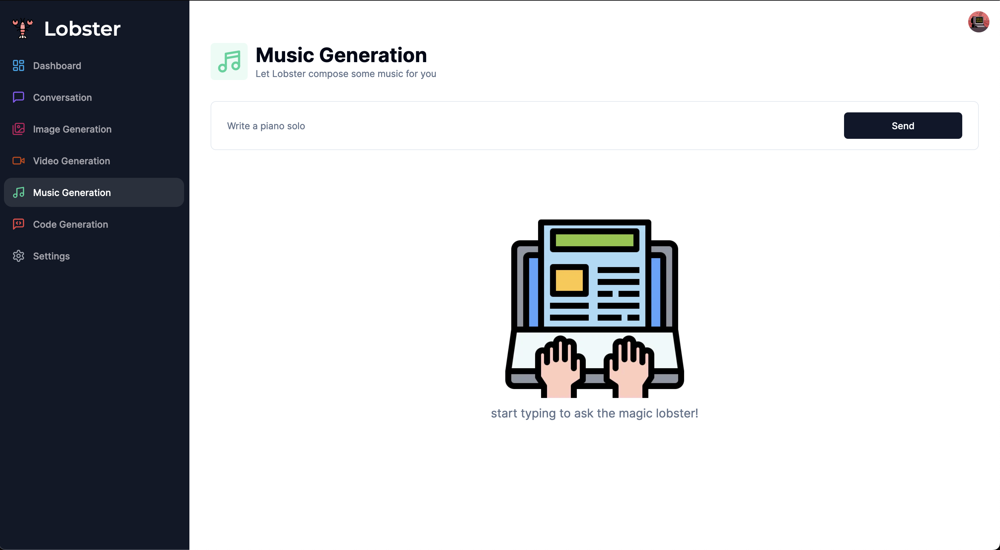
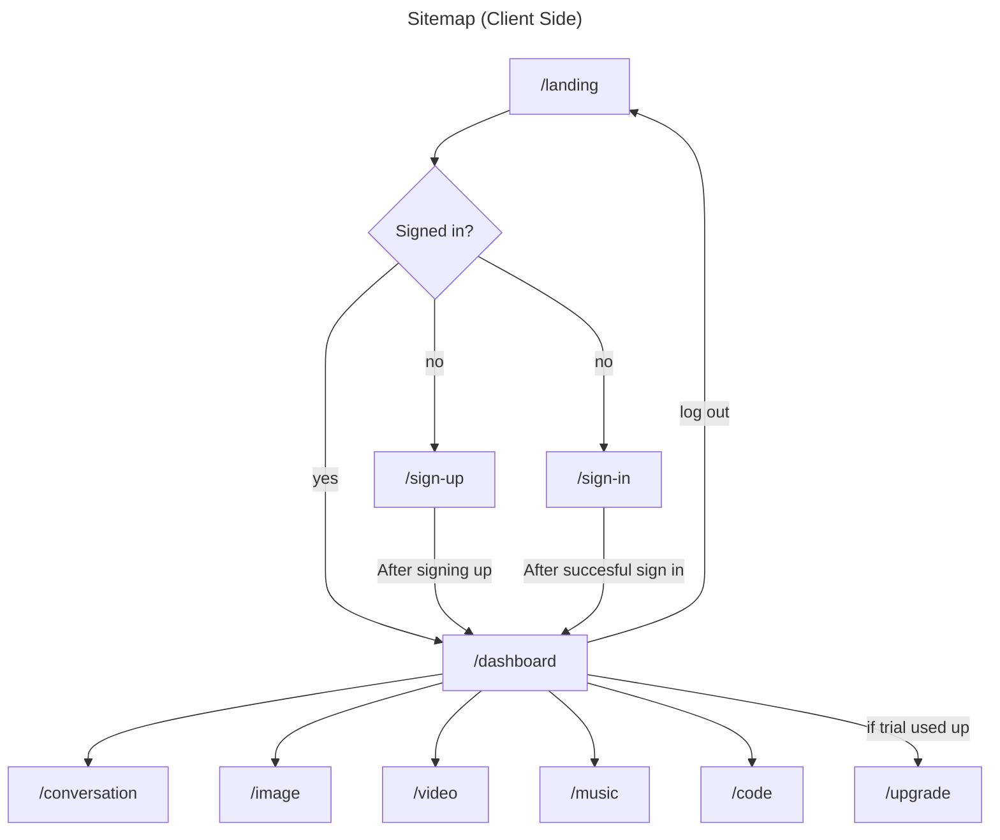

# Lobster AI

## Overview

Recall how you have to wander around the internet on different platforms to find different AI services such as music and video generation... 

Lobster AI is a paid AI service that combines major AI platforms and further enhances your interactions with AI. Let the Lobster be in the palm of your hand! Start to have conversations, generate image, music, videos, code with the powerful Lobster! 


## Data Model

The application will store `Users`, `Subscription` and `History`

* each user is linked to a subscription of three tiers: `free`, `standard` and `pro` (via references)
* each user has a history, which records that user's former requests within the app (viewable upon updrading to standard or pro tier)

An Example User:

```javascript
{
  id: 'h1i2uhupuohr10' // use for reference
  username: "shannonshopper",
  hash: // a password hash,
}
```

An Example Subscription

```javascript
{
  user: // a reference to a User object
  tier: "free", // the tier which the user is in
  createdAt: // timestamp
}
```

An Example History

```javascript
{
  user: // a reference to a User object
  history: [ // arr of former reqs made 
    {
      prompt: 'how to embed a youtube link in html?'
      createdAt: // timestamp
    },
    {
      prompt: 'list of best ramen shops in NYC',
      createdAt: // timestamp
    },
    ...
  ]
}
```


## [Link to Commented First Draft Schema](https://github.com/nyu-csci-ua-0467-001-002-spring-2024/final-project-jsl1114/blob/master/prisma/schema.prisma)

*note: this app uses [prisma ORM](https://www.prisma.io/), schemas are stored within [/prisma/schema.prisma](./prisma/schema.prisma)*

## Wireframes

/ - landing page



/dashboard - dashboard page for an overview of all services



/conversation - page for conversation with lobster



/image - page for image generation



/video - page for video generation



/code - page for code generation



/music - page for music generation





## User Stories or Use Cases

1. as non-registered user, I can register a new account with the site
2. as a new user defaulted to free tier, I can log in to the site and pay for upgrades
3. as a free tier user, I can send a total of 10 requests to the api as free trial. After that, I will be instructed to pay for an upgrade in order to continue using the app
4. as a standard tier user, I pay 39 dollars a month and have access to all the generation tools, with limit on certain features
5. as a pro tier user, I pay 49 dollars a month and have access to all of the features on the website with the newest models, plus access to user history, which shows the past quries and responses, up tp 90 days

## Research Topics

| Points |                       Topic                        | Notes                                                                                  |
| :----: | :------------------------------------------------: | :------------------------------------------------------------------------------------- |
|   5    |            Automated Functional Testing            | using [Cypress](https://nextjs.org/docs/app/building-your-application/testing/cypress) |
|   6    |                 Frontend Framework                 | [Next.js](https://nextjs.org/)                                                         |
|   5    |                User Authentication                 | [clerk](https://clerk.com/)                                                            |
|   2    |                   CSS framework                    | [tailwind.css](https://tailwindcss.com/)                                               |
|   2    |                      Sitemap                       | [Mermaid](https://mermaid.js.org/)                                                     |
|   1    | OpenAI chat generation API <br> (with finetuning.) | [link](https://platform.openai.com/docs/guides/text-generation)                        |
|   1    |     OpenAI DALL·E API  <br> (with finetuning.)     | [link](https://platform.openai.com/docs/guides/images?context=node  )                  |
|   1    |           Replicate AI music generation            | [link](https://replicate.com/docs/get-started/nextjs)                                  |

More to be added. Total of **23 / 10** points

10 points total out of 8 required points 


## [Link to Initial Main Project File](/app/) 

## Annotations / References Used

|                       Topic                        | Reference                                                                        |
| :------------------------------------------------: | :------------------------------------------------------------------------------- |
|            Automated Functional Testing            | [Cypress](https://nextjs.org/docs/app/building-your-application/testing/cypress) |
|                 Frontend Framework                 | [Next.js](https://nextjs.org/)                                                   |
|                User Authentication                 | [clerk](https://clerk.com/)                                                      |
|                   CSS framework                    | [tailwind.css](https://tailwindcss.com/)                                         |
| OpenAI chat generation API <br> (with finetuning.) | [link](https://platform.openai.com/docs/guides/text-generation)                  |
|     OpenAI DALL·E API  <br> (with finetuning.)     | [link](https://platform.openai.com/docs/guides/images?context=node  )            |
|           Replicate AI music generation            | [link](https://replicate.com/docs/get-started/nextjs)                            |
